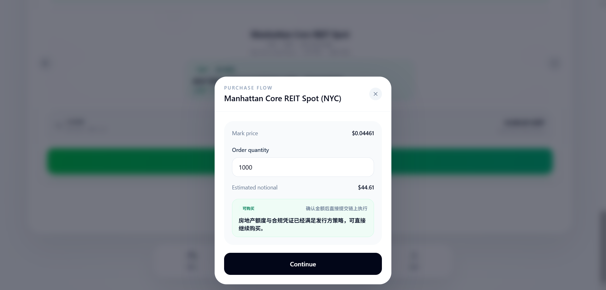
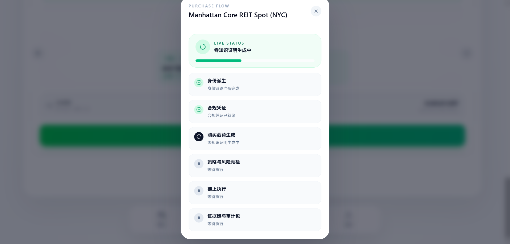
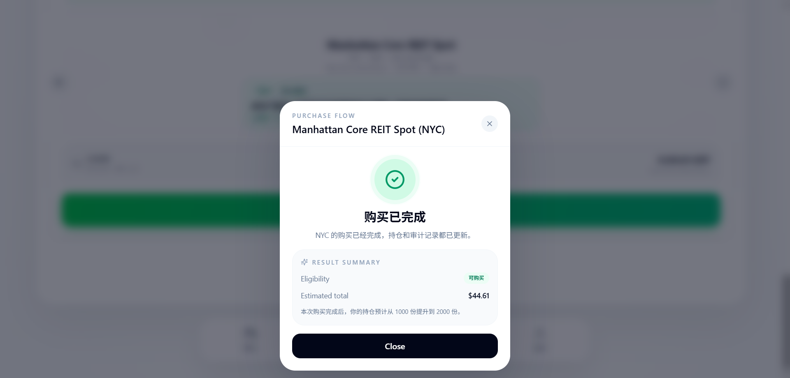
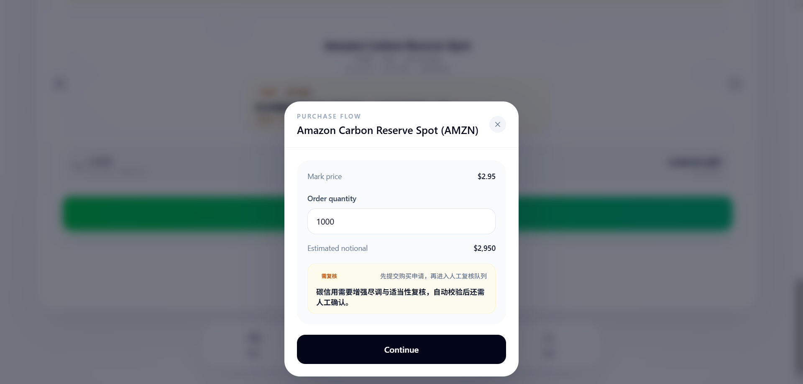
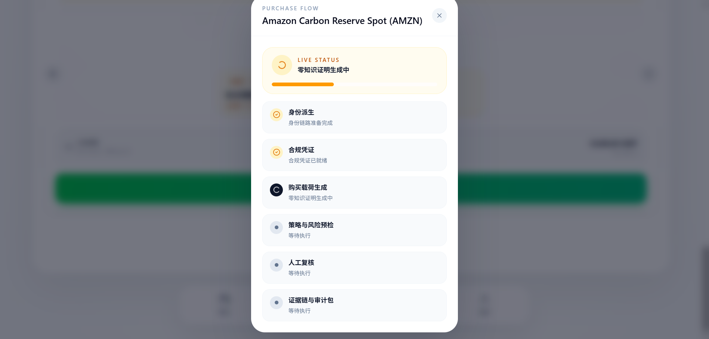
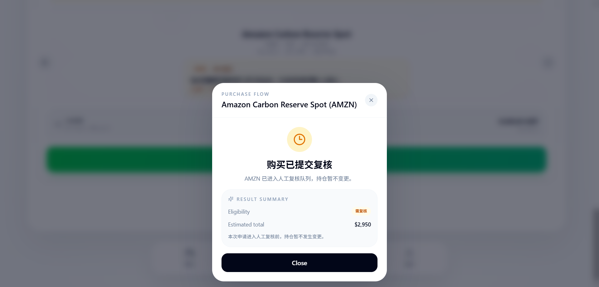
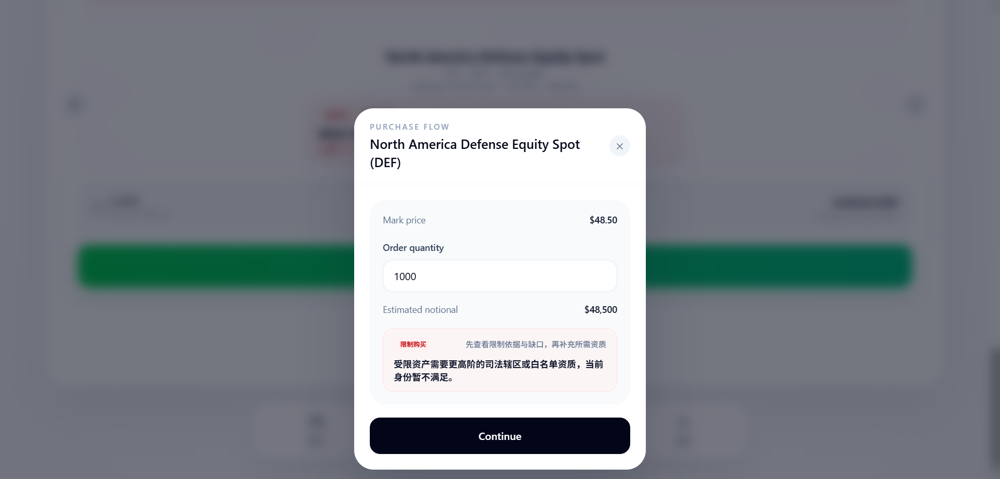
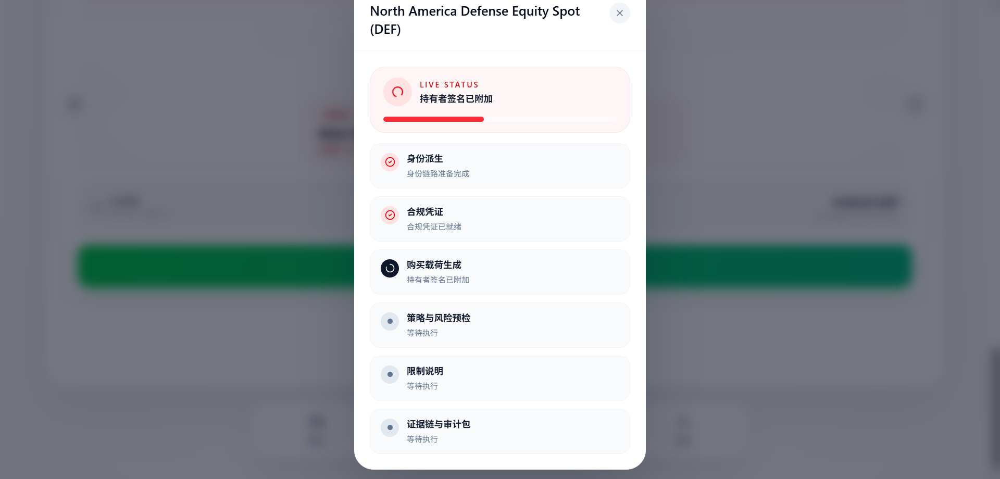
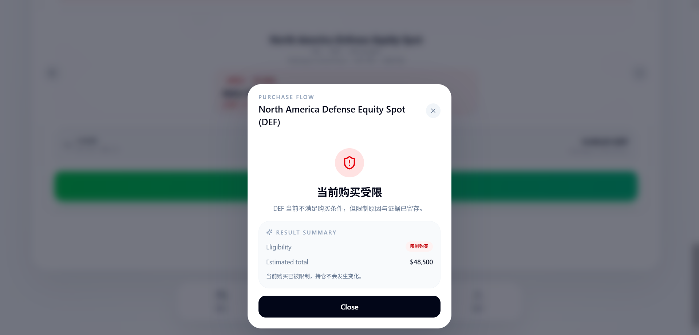

# Web3ID Demo Guide

[English](./DEMO_EN.md) | 简体中文

这个文档把 Web3ID 的演示拆成两层: 第一层跟随当前 PPT 的主叙事来讲“为什么需要 Web3ID”；第二层落到仓库里真实存在的命令、页面和系统入口，帮助评审、协作者和开发者快速完成从 `README` 到可运行 demo 的闭环。

如果你只想最快看到系统基线，优先运行:

```powershell
pnpm install
pnpm proof:setup
pnpm demo:platform
```

正式演示材料: [中文 PDF](./docs/presentation/Web3ID-identity-new-order-zh.pdf)
线上 Demo: [Live Demo](https://web3id-demo.vercel.app)

当前线上站点默认运行 `mock` 数据模式，用于公开展示，不依赖 `issuer-service / analyzer-service / policy-api` 在线服务。

## 1. 叙事映射

| PPT 叙事段落 | 你要讲的重点 | 仓库里的演示证据 |
| --- | --- | --- |
| 行业问题 | Web3 长期卡在匿名与信任、隐私与合规的对立上 | `README.md`、[`docs/WHAT_IS_WEB3ID.md`](./docs/WHAT_IS_WEB3ID.md)、[`docs/WHY_SYSTEM_NOT_JUST_PLATFORM.md`](./docs/WHY_SYSTEM_NOT_JUST_PLATFORM.md) |
| Web3ID 的核心主张 | 这不是 wallet-login demo，而是把 identity、proof、policy、audit、governance 放进同一条系统主链路 | `README.md` 的系统主张与技术架构、[`docs/SYSTEM_MODEL.md`](./docs/SYSTEM_MODEL.md) |
| 分层身份树与多链控制权 | `RootIdentity + SubIdentity + SubjectAggregate` 把控制权、场景隔离和主体归并分层处理 | 钱包页身份树、[`docs/MULTICHAIN_SUBJECT_AGGREGATE.md`](./docs/MULTICHAIN_SUBJECT_AGGREGATE.md)、[`docs/CHAIN_FAMILY_MATRIX.md`](./docs/CHAIN_FAMILY_MATRIX.md) |
| 双轨模式: 默认 / 合规 | 默认路径不强制 KYC；合规路径通过 VC + proof 完成隐私友好的准入验证 | `pnpm demo:stage1`、`pnpm demo:stage2`、市场页购买流程、[`docs/default-vs-compliance-mode.md`](./docs/default-vs-compliance-mode.md) |
| 动态状态、责任与后果 | 风险不是黑箱分数，而是 formal state chain 与 consequence chain | `pnpm demo:stage3`、`pnpm demo:platform`、[`docs/STATE_SYSTEM_INVARIANTS.md`](./docs/STATE_SYSTEM_INVARIANTS.md)、[`docs/EXPLANATION_AND_AUDIT_CHAIN.md`](./docs/EXPLANATION_AND_AUDIT_CHAIN.md) |
| AI 边界与治理 | AI 可以辅助发现风险和生成解释，但不能直接裁决或写状态 | `README.md`、[`docs/ai-risk-policy-governance-boundaries.md`](./docs/ai-risk-policy-governance-boundaries.md)、[`docs/GOVERNANCE_CONTROL_PLANE.md`](./docs/GOVERNANCE_CONTROL_PLANE.md) |
| 应用场景与价值总结 | Web3ID 面向 RWA、企业支付/审计、社交治理，也为 AI Agent 身份执行提供基础设施 | `stage1 / stage2 / stage3 / platform` 四条 demo 路径、[`docs/DEMO_MATRIX.md`](./docs/DEMO_MATRIX.md) |

## 2. 演示环境与启动

### 推荐入口

| 目标 | 命令 | 说明 |
| --- | --- | --- |
| 最快看全局 | `pnpm demo:platform` | 推荐给评审和第一次看仓库的人 |
| 最小合规路径 | `pnpm demo:stage1` | 聚焦 VC / proof / access policy |
| 对比默认与合规 | `pnpm demo:stage2` | 聚焦双轨模式与场景对比 |
| 全栈审计与治理 | `pnpm demo:stage3` | 聚焦 analyzer / policy / operator 流程 |
| 前端本地浏览 | `pnpm dev` | `issuer-service + frontend` |
| 核心服务联调 | `pnpm dev:stage3` | `issuer-service + analyzer-service + policy-api + frontend` |

### 默认本地地址

| 服务 | 地址 |
| --- | --- |
| `frontend` | `http://127.0.0.1:3000` |
| `issuer-service` | `http://127.0.0.1:4100` |
| `analyzer-service` | `http://127.0.0.1:4200` |
| `policy-api` | `http://127.0.0.1:4300` |

### 演示前提

- `pnpm install`
- `cp .env.example .env`
- 如果要跑 proof / contract 路径，先执行 `pnpm proof:setup`
- 如果只看前端产品壳和静态体验，默认 `mock` 模式即可
- 如果要讲 analyzer / policy / audit 闭环，优先使用 `pnpm demo:stage3` 或 `pnpm demo:platform`

线上公开 Demo 仍然运行在 `mock` 模式。这里补充 BNB 说明，表示仓库里的前端运行时和演示路径已经覆盖 BNB，并不表示公开站点依赖实时 BNB RPC。

## 3. 产品入口

当前前端真实路由如下:

| 路由 | 页面/模块 | 适合展示什么 |
| --- | --- | --- |
| `/` | Wallet / Card Wallet | 钱包卡片、身份树、消息收件箱、场景入口 |
| `/mall` | Trading Exchange | RWA 资产、交易面板、购买动作、默认/合规准入差异 |
| `/portfolio` | Portfolio | 资产配置、持仓价值、组合分析 |
| `/history` | Transaction History | 交易记录、状态过滤、审计友好型历史视图 |
| `/profile` | Profile | 根身份、KYC/AML 状态、子身份数量、语言切换、系统配置入口 |

当前前端 EVM 演示已经把 `BNB Chain (56)` 作为正式支持链接入钱包页，可用来展示钱包卡片、身份树和 EVM controller 路径；本地开发默认链仍是 `31337`。

除此之外，演示时最值得点开的交互面包括:

- 钱包页里的 `Inbox`，适合讲 cross-domain / operator / notification 叙事
- 钱包页里的 `IdentityTreeView`，适合讲 `RootIdentity`、多场景 `SubIdentity` 和状态传播
- 市场页里的 `RWAPurchaseModal`，适合讲 access decision 与 purchase gating
- Profile 页里的 identity / compliance 分组，适合把“身份系统”讲成产品感知而不是底层抽象

## 4. 推荐演示路径

### A. 3 分钟总览

1. 从 `pnpm demo:platform` 开始，说明这是一套系统级 identity baseline。
2. 进入钱包页 `/`，展示根身份、子身份、消息入口和身份树。
3. 切到市场页 `/mall`，讲“默认模式 vs 合规模式”的准入差异。
4. 切到历史页 `/history` 或组合页 `/portfolio`，强调这不是单次 proof，而是持续可审计的运行系统。
5. 用一句话收束: `policy is not state`，AI 不是最终裁决者，所有行为都必须回到本地 formal semantics。

### B. RWA Access 路线

最适合对应 PPT 里的“隐私与合规平衡”主题。

| 步骤 | 建议操作 | 要强调的点 |
| --- | --- | --- |
| 1 | 运行 `pnpm demo:stage1` 或 `pnpm demo:platform` | 进入最小合规路径 |
| 2 | 展示钱包页 `/` | 身份不是一个地址，而是根身份与子身份体系 |
| 3 | 切到市场页 `/mall` | 选取 RWA 类资产并触发购买 |
| 4 | 展示购买弹窗 / 准入反馈 | 凭证、proof、policy 在同一条链路上协同 |
| 5 | 回到历史或审计解释 | 这不是一次性审批，而是可追溯的系统判断 |

### C. Enterprise / Audit 路线

最适合讲“责任链、后果链、审计闭环”。

| 步骤 | 建议操作 | 要强调的点 |
| --- | --- | --- |
| 1 | 运行 `pnpm demo:stage3` 或 `pnpm demo:platform` | 带上 analyzer 与 policy-api |
| 2 | 展示钱包页身份树与状态信息 | 风险信号不会直接跳过状态链 |
| 3 | 切到历史页 `/history` | 交易记录是 audit-friendly 的观察面 |
| 4 | 引用 `docs/EXPLANATION_AND_AUDIT_CHAIN.md` | 解释链和证据连续性是系统内建能力 |
| 5 | 结束时强调 | `audit` 不是事后补材料，而是主链路的一部分 |

### D. Social Governance 路线

最适合讲默认路径、warning policy 和 AI 边界。

| 步骤 | 建议操作 | 要强调的点 |
| --- | --- | --- |
| 1 | 运行 `pnpm demo:stage2`、`pnpm demo:stage3` 或 `pnpm demo:platform` | 对比默认路径与合规路径 |
| 2 | 从钱包页身份树切入 | 不同 `SubIdentity` 的风险与后果可以隔离 |
| 3 | 说明 analyzer / review / governance 关系 | AI 只生成建议或提示，不直接裁决 |
| 4 | 引用治理和边界文档 | 风险治理不是黑箱，也不是单纯分数系统 |
| 5 | 总结 | 默认保护隐私，但责任不能被匿名掩盖 |

## 5. 场景切换说明

| Demo 脚本 | 适合谁 | 重点 | 常见失败点 |
| --- | --- | --- | --- |
| `pnpm demo:stage1` | 想先讲最小闭环的人 | `RWA Access` | proof artifacts 缺失、anvil 未就绪、issuer-service 未响应 |
| `pnpm demo:stage2` | 想讲双轨模式的人 | `RWA Access + Social Governance` | proof runtime 未初始化、前端缺少 contract env、issuer-service 未注册 identity tree |
| `pnpm demo:stage3` | 想讲全栈状态与审计的人 | `RWA Access + Enterprise / Audit + Social Governance` | analyzer 未绑定 identity tree、policy-api 不可用、review/watcher 未刷新 |
| `pnpm demo:platform` | 推荐默认入口 | 平台总览 + 合规路径 + 默认路径 + 审计收束 | proof runtime 缺失、analyzer/policy 服务未健康、operator 状态未刷新 |

如果你只做一次 live demo，优先选 `pnpm demo:platform`。如果你要针对不同评审重点做拆分演示，再回到 `stage1 / stage2 / stage3`。

## 6. FAQ / 常见观察点

### 为什么仓库里还有 `stage1 / stage2 / stage3 / platform` 四条路径?

因为它们代表的是同一套系统基线的不同观察面，而不是四个互不相干的小样例。

### 前端为什么同时有 `mock` 和 `api` 两种模式?

`mock` 适合稳定展示 UI 和交互结构；`api` 适合接入外部 read-model 或联调服务。前者更适合静态演示，后者更适合工程整合。

### 多链支持是不是已经全部体现在钱包连接 UI 上?

不是。当前多链 controller 扩展主要落在 backend、SDK、analyzer、verifier 与 audit 主链路上，不代表每个 family 都已经有独立 wallet-connect UI。前端现在明确覆盖的是 EVM 演示路径里的本地 `31337` 与 `BNB Chain (56)`。

### AI 在这个系统里到底做什么?

AI 可以发现异常模式、生成风险提示、辅助解释，但不能直接写 formal state，也不能跳过人工 review 与本地边界。

### 最应该让评审记住哪一句话?

`policy is not state`。Web3ID 的核心不是把更多规则堆上去，而是先把身份、状态、后果、审计和治理的边界锁住。

## 7. 截图与视频素材清单

### 核心截图

| 素材 | 建议页面/入口 | 要拍什么 | 为什么重要 |
| --- | --- | --- | --- |
| 首页/总览 | `/` | 钱包首页、卡片、身份状态、Inbox 入口 | 让人一眼看到“这是产品，不只是文档” |
| 钱包与身份页 | `/` + 身份树展开 | `RootIdentity`、多个 `SubIdentity`、状态变化、恢复提示 | 对应 PPT 里的分层身份树 |
| proof / policy / audit 相关画面 | `/mall` + 购买弹窗 + `/history` | 准入反馈、交易结果、历史记录 | 对应双轨模式与审计闭环 |
| 风险状态或治理画面 | `/` 的身份树细节或配套系统文档图 | Warning / Restricted 等状态、治理说明 | 对应动态状态与责任后果 |
| 多链或 aggregate 展示 | 钱包页身份树 + 文档辅助图 | 主体归并、多链控制权、统一 envelope | 对应“单地址之外的身份系统” |
| 默认模式 vs 合规模式对照图 | `/mall` + 购买动作前后 | 同一场景下的两种准入路径 | 对应 PPT 的双轨模式 |
| 场景流程顺序图 | 钱包 -> 市场 -> 历史 / 审计 | 3 到 5 张连续截图 | 以后可直接拿去做视频分镜 |

### 推荐截图顺序

1. 钱包首页总览
2. 身份树展开
3. 市场页资产列表
4. 购买弹窗 / 准入结果
5. 组合页或历史页
6. Profile 页中的 identity / compliance 分组

### 已准备截图

#### 钱包首页总览


#### 身份树展开


#### 市场页资产列表


#### 购买弹窗 / 结果


#### 历史页


#### Profile 中的 identity / compliance 分组


### 购买结果矩阵

#### Approved: NYC direct execution

Manhattan Core REIT Spot (`NYC`) 展示默认通过路径: 购买弹窗直接给出可购买 verdict，随后进入 live status，最后落到已完成结果页。







#### Review: AMZN manual queue

Amazon Carbon Reserve Spot (`AMZN`) 展示需复核路径: 自动校验先生成 proof 和载荷，再把订单送入人工复核队列，结果页保留 pending review 语义。







#### Restricted: DEF denied purchase

North America Defense Equity Spot (`DEF`) 展示限制购买路径: 购买弹窗先解释限制原因，live status 记录限制说明链路，最终结果页明确当前购买受限。







## 8. 为视频预留的脚本骨架

这份文档本身就可以作为后续录屏视频的母版:

- 开场 20 秒: 行业问题与 Web3ID 的一句话定位
- 中段 60 到 120 秒: 钱包 -> 身份树 -> 市场购买 -> 历史/审计
- 收束 20 到 40 秒: AI 边界、治理边界、系统价值主张

后续如果补视频，只需要把第 4 节的路径压缩成口播稿和镜头顺序，不需要重新设计结构。

## 9. 延伸阅读

- [`README.md`](./README.md)
- [`docs/presentation/Web3ID-identity-new-order-zh.pdf`](./docs/presentation/Web3ID-identity-new-order-zh.pdf)
- [`docs/DEMO_MATRIX.md`](./docs/DEMO_MATRIX.md)
- [`docs/SYSTEM_MODEL.md`](./docs/SYSTEM_MODEL.md)
- [`docs/SYSTEM_ACCEPTANCE.md`](./docs/SYSTEM_ACCEPTANCE.md)
- [`docs/PLATFORM_CONSOLE.md`](./docs/PLATFORM_CONSOLE.md)
