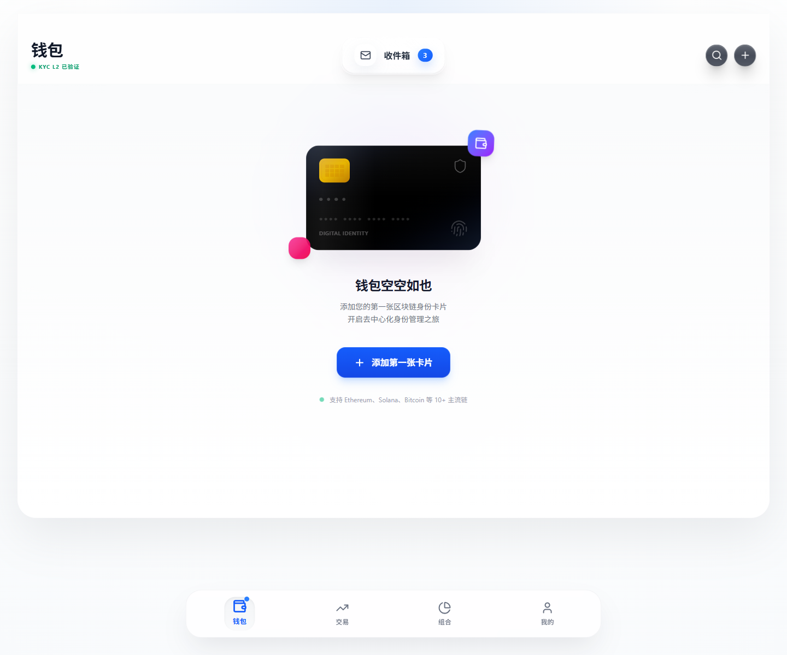
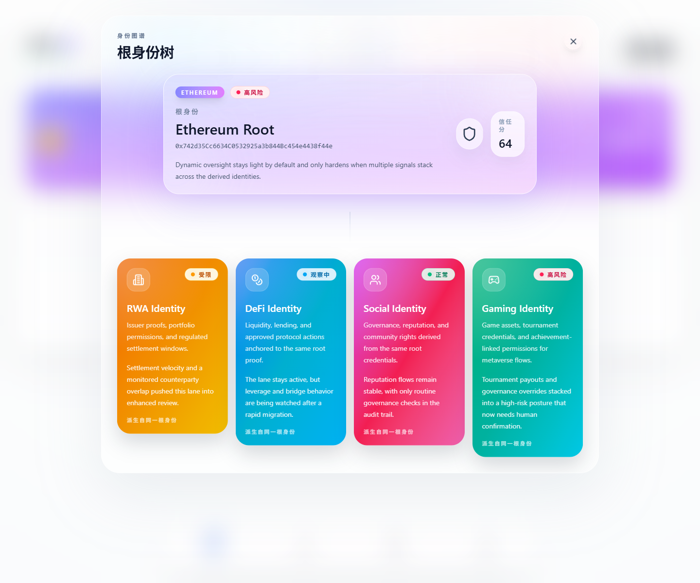
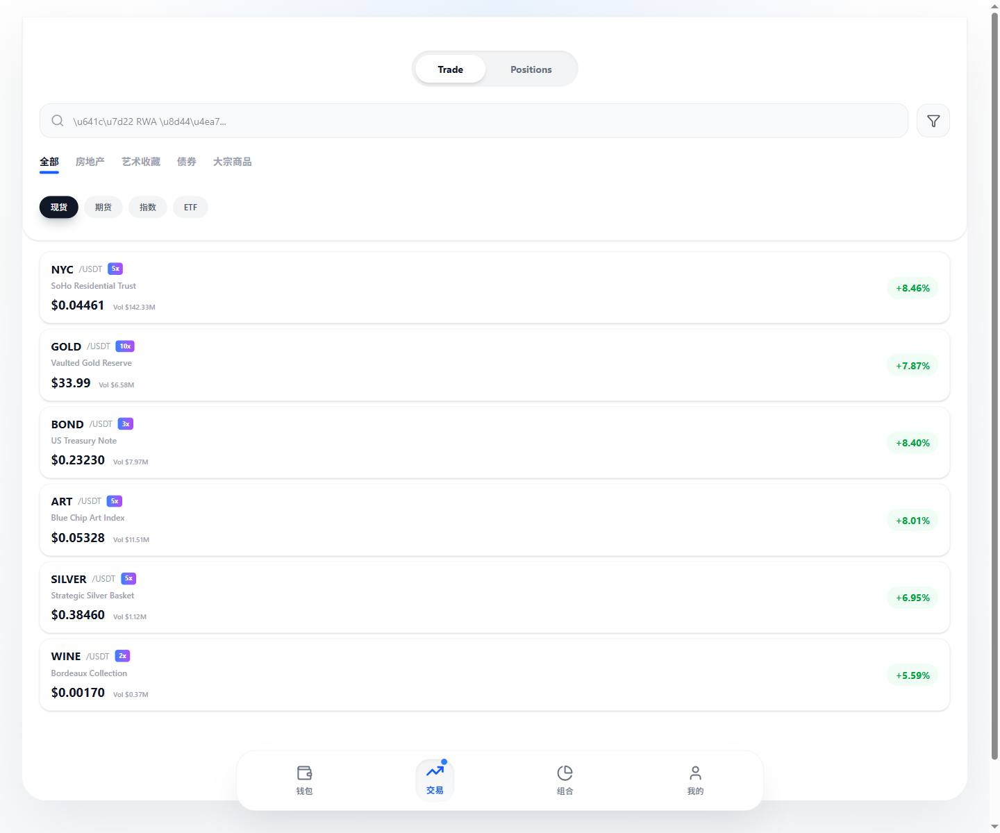
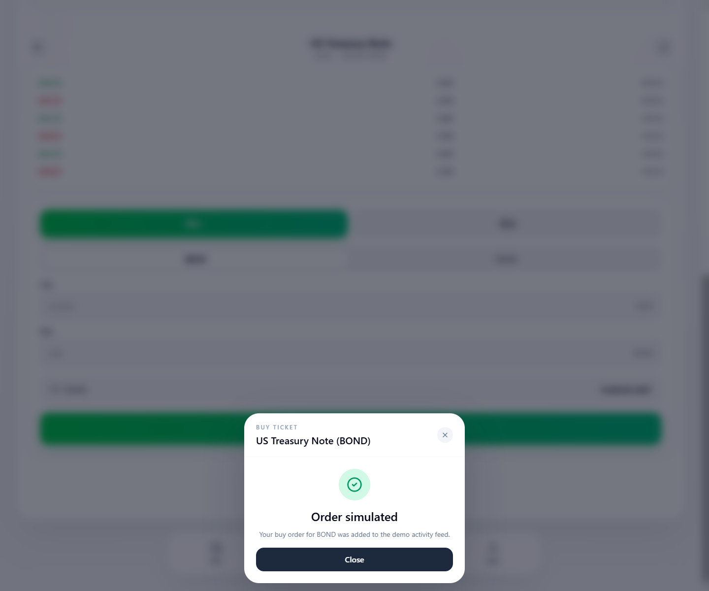
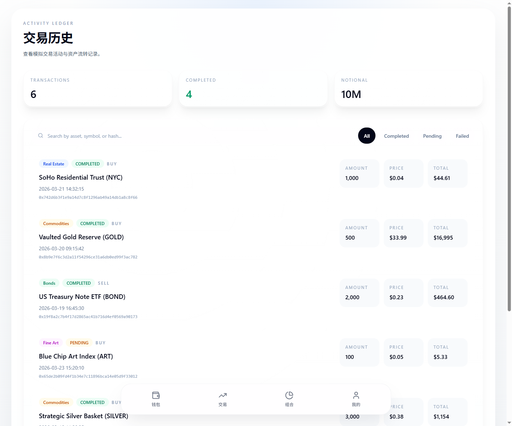
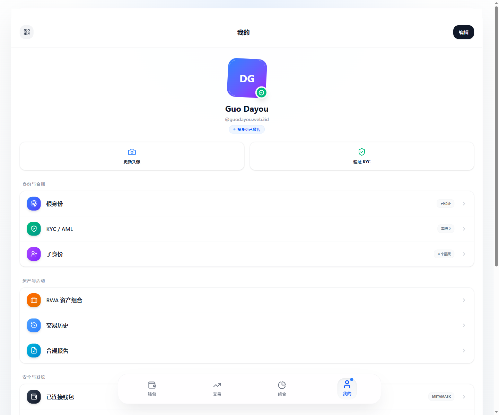

# Web3ID Demo Guide

[中文](./DEMO.md) | English

This document turns the Web3ID demo into two layers. The first follows the current presentation narrative and explains why Web3ID exists. The second maps that narrative onto real commands, routes, and system entry points that already exist in this repository, so readers can move from `README` to a runnable demo without guessing.

If you only want the fastest path into the baseline system, start with:

```powershell
pnpm install
pnpm proof:setup
pnpm demo:platform
```

## 1. Narrative Mapping

| Narrative Segment | What To Say | Demo Evidence In The Repo |
| --- | --- | --- |
| Industry problem | Web3 is still stuck between anonymity and trust, and between privacy and compliance | `README_EN.md`, [`docs/WHAT_IS_WEB3ID.md`](./docs/WHAT_IS_WEB3ID.md), [`docs/WHY_SYSTEM_NOT_JUST_PLATFORM.md`](./docs/WHY_SYSTEM_NOT_JUST_PLATFORM.md) |
| Core Web3ID claim | This is not a wallet-login demo. It is a system chain where identity, proof, policy, audit, and governance coexist in one baseline | `README_EN.md`, the architecture section, [`docs/SYSTEM_MODEL.md`](./docs/SYSTEM_MODEL.md) |
| Layered identity tree and multi-chain control | `RootIdentity + SubIdentity + SubjectAggregate` separate control, scenario isolation, and subject aggregation | Wallet identity tree, [`docs/MULTICHAIN_SUBJECT_AGGREGATE.md`](./docs/MULTICHAIN_SUBJECT_AGGREGATE.md), [`docs/CHAIN_FAMILY_MATRIX.md`](./docs/CHAIN_FAMILY_MATRIX.md) |
| Dual-track modes: default / compliance | The default path does not force KYC; the compliance path uses VC + proof for privacy-preserving access | `pnpm demo:stage1`, `pnpm demo:stage2`, the market purchase flow, [`docs/default-vs-compliance-mode.md`](./docs/default-vs-compliance-mode.md) |
| Dynamic state, responsibility, and consequences | Risk is not a black-box score. It is a formal state chain with explicit consequences | `pnpm demo:stage3`, `pnpm demo:platform`, [`docs/STATE_SYSTEM_INVARIANTS.md`](./docs/STATE_SYSTEM_INVARIANTS.md), [`docs/EXPLANATION_AND_AUDIT_CHAIN.md`](./docs/EXPLANATION_AND_AUDIT_CHAIN.md) |
| AI boundary and governance | AI can assist discovery and explanation, but it cannot directly decide or write state | `README_EN.md`, [`docs/ai-risk-policy-governance-boundaries.md`](./docs/ai-risk-policy-governance-boundaries.md), [`docs/GOVERNANCE_CONTROL_PLANE.md`](./docs/GOVERNANCE_CONTROL_PLANE.md) |
| Scenarios and value | Web3ID targets RWA, enterprise payment/audit, social governance, and eventually AI agent execution identity | `stage1 / stage2 / stage3 / platform`, [`docs/DEMO_MATRIX.md`](./docs/DEMO_MATRIX.md) |

## 2. Demo Environment And Startup

### Recommended Entrypoints

| Goal | Command | Notes |
| --- | --- | --- |
| Fastest overall walkthrough | `pnpm demo:platform` | Recommended for judges, readers, and first-time viewers |
| Minimal compliance path | `pnpm demo:stage1` | Focused on VC / proof / access policy |
| Default vs compliance comparison | `pnpm demo:stage2` | Best for the dual-track story |
| Full-stack audit and governance | `pnpm demo:stage3` | Best for analyzer / policy / operator flow |
| Frontend-only browsing | `pnpm dev` | Starts `issuer-service + frontend` |
| Core service integration | `pnpm dev:stage3` | Starts `issuer-service + analyzer-service + policy-api + frontend` |

### Default Local URLs

| Service | URL |
| --- | --- |
| `frontend` | `http://127.0.0.1:3000` |
| `issuer-service` | `http://127.0.0.1:4100` |
| `analyzer-service` | `http://127.0.0.1:4200` |
| `policy-api` | `http://127.0.0.1:4300` |

### Demo Preconditions

- `pnpm install`
- `cp .env.example .env`
- Run `pnpm proof:setup` before proof / contract-based paths
- If you only want the product shell and static experience, the default `mock` mode is enough
- If you want the analyzer / policy / audit closed loop, prefer `pnpm demo:stage3` or `pnpm demo:platform`

## 3. Product Surfaces

The current frontend routes are:

| Route | Page / Module | Why It Matters In A Demo |
| --- | --- | --- |
| `/` | Wallet / Card Wallet | Wallet cards, identity tree, inbox, and scenario entry |
| `/mall` | Trading Exchange | RWA assets, trade panel, purchase action, and default/compliance gating |
| `/portfolio` | Portfolio | Allocation, holdings value, and portfolio analytics |
| `/history` | Transaction History | Audit-friendly transaction history and status filtering |
| `/profile` | Profile | Root identity, KYC/AML state, sub-identity count, language switch, and system settings |

The most important interactions to click during a live demo are:

- `Inbox` on the wallet page for cross-domain / operator / notification storytelling
- `IdentityTreeView` on the wallet page for `RootIdentity`, scenario `SubIdentity`, and state propagation
- `RWAPurchaseModal` on the market page for access decisions and purchase gating
- The identity / compliance sections on the profile page for turning the system model into a product surface

## 4. Recommended Demo Routes

### A. 3-Minute Overview

1. Start from `pnpm demo:platform` and frame Web3ID as a system-grade identity baseline.
2. Open the wallet page at `/` and show the root identity, sub-identities, inbox, and identity tree.
3. Move to `/mall` and explain the difference between the default path and the compliance path.
4. Move to `/history` or `/portfolio` and show that this is not a one-time proof flow, but a persistent auditable system.
5. Close with one line: `policy is not state`, AI is not the final decision-maker, and every action must resolve back into local formal semantics.

### B. RWA Access Route

This route fits the "privacy and compliance balance" segment of the presentation.

| Step | Suggested Action | What To Emphasize |
| --- | --- | --- |
| 1 | Run `pnpm demo:stage1` or `pnpm demo:platform` | Start from the minimal compliance path |
| 2 | Show the wallet page at `/` | Identity is not just one address; it is a root-plus-sub-identity system |
| 3 | Move to `/mall` | Choose an RWA-like asset and trigger a purchase |
| 4 | Show the purchase modal / gating feedback | Credential, proof, and policy work in one chain |
| 5 | Return to history or audit explanation | This is not a one-off approval; it is a traceable system judgment |

### C. Enterprise / Audit Route

This route is best for responsibility chains, consequence chains, and audit closure.

| Step | Suggested Action | What To Emphasize |
| --- | --- | --- |
| 1 | Run `pnpm demo:stage3` or `pnpm demo:platform` | Bring analyzer and policy-api into the story |
| 2 | Show the wallet identity tree and state surface | Risk signals do not bypass the state chain |
| 3 | Move to `/history` | The transaction view is an audit-friendly observation surface |
| 4 | Reference `docs/EXPLANATION_AND_AUDIT_CHAIN.md` | Evidence continuity and explanation are system features, not add-ons |
| 5 | Close with one line | `audit` is part of the main chain, not after-the-fact paperwork |

### D. Social Governance Route

This route is best for the default path, warning policy, and AI boundary.

| Step | Suggested Action | What To Emphasize |
| --- | --- | --- |
| 1 | Run `pnpm demo:stage2`, `pnpm demo:stage3`, or `pnpm demo:platform` | Compare the default path with the compliance path |
| 2 | Start from the wallet identity tree | Different `SubIdentity` lanes can isolate risk and consequences |
| 3 | Explain analyzer / review / governance | AI generates signals and suggestions, but does not decide |
| 4 | Reference governance and boundary docs | Risk governance is not a black box or just a score |
| 5 | Close with one line | Privacy is protected by default, but responsibility cannot hide behind anonymity |

## 5. Scenario Switching

| Demo Script | Best For | Focus | Common Failure Points |
| --- | --- | --- | --- |
| `pnpm demo:stage1` | Minimal baseline walkthroughs | `RWA Access` | missing proof artifacts, anvil not ready, issuer-service unavailable |
| `pnpm demo:stage2` | Dual-track storytelling | `RWA Access + Social Governance` | proof runtime not initialized, missing frontend contract env, issuer tree not registered |
| `pnpm demo:stage3` | Full-stack state and audit | `RWA Access + Enterprise / Audit + Social Governance` | analyzer not bound to the identity tree, policy-api unavailable, review/watchers not refreshed |
| `pnpm demo:platform` | Recommended default entry | platform overview + compliance path + default path + audit closure | missing proof runtime, unhealthy analyzer/policy services, operator state not refreshed |

If you only do one live demo, pick `pnpm demo:platform`. If you need tailored judge-facing paths, split back into `stage1 / stage2 / stage3`.

## 6. FAQ / What Viewers Usually Ask

### Why does the repo still keep `stage1 / stage2 / stage3 / platform`?

Because they are different observation surfaces over one baseline system, not four unrelated demo apps.

### Why does the frontend have both `mock` and `api` modes?

`mock` is better for stable UI demos and browsing. `api` is better for integrating external read models or doing service-level integration work.

### Does multi-chain support already show up as full wallet-connect UI for every chain family?

No. The current multi-chain expansion mainly lives in backend, SDK, analyzer, verifier, and audit paths. It does not mean every family already has its own dedicated wallet-connect UI.

### What does AI actually do in this system?

AI can detect patterns, generate risk hints, and assist explanation. It cannot directly write formal state or bypass human review and local system boundaries.

### What is the one sentence judges should remember?

`policy is not state`. The core of Web3ID is not adding more rules. It is locking identity, state, consequence, audit, and governance boundaries first.

## 7. Screenshot And Video Asset Checklist

### Core Screenshots

| Asset | Suggested Surface | What To Capture | Why It Matters |
| --- | --- | --- | --- |
| Home / overview | `/` | wallet home, cards, identity status, inbox entry | proves there is a product surface, not just system docs |
| Wallet and identity | `/` with expanded identity tree | `RootIdentity`, multiple `SubIdentity` lanes, state hints, recovery notes | maps directly to the layered identity-tree narrative |
| proof / policy / audit view | `/mall` + purchase modal + `/history` | gating feedback, purchase result, history record | supports the dual-track and audit-closure story |
| Risk or governance view | wallet identity tree details or supporting system docs | warning / restricted state, governance explanation | supports dynamic state and consequence narration |
| Multi-chain or aggregate view | wallet identity tree plus supporting docs | subject aggregation, multi-chain control, unified envelope | supports the "beyond a single address" message |
| Default vs compliance comparison | `/mall` before and after purchase action | the same asset flow under two access modes | supports the dual-track mode segment |
| Scenario flow sequence | wallet -> market -> history / audit | 3 to 5 screenshots in order | becomes the basis for a later video storyboard |

### Recommended Screenshot Order

1. Wallet home overview
2. Expanded identity tree
3. Market asset list
4. Purchase modal / gating result
5. Portfolio or history page
6. Profile page with identity / compliance grouping

### Prepared Screenshots

#### Wallet Home Overview



#### Expanded Identity Tree



#### Market Asset List



#### Purchase Modal / Result



#### History Page



#### Profile Identity / Compliance Grouping



## 8. Video Script Foundation

This document is already a usable base for the later demo video:

- Opening 20 seconds: the industry problem and the one-line positioning of Web3ID
- Middle 60 to 120 seconds: wallet -> identity tree -> market purchase -> history / audit
- Closing 20 to 40 seconds: AI boundary, governance boundary, and the system value claim

When you decide to record video later, we can compress Section 4 into a voiceover script and shot list instead of redesigning the structure from scratch.

## 9. Further Reading

- [`README_EN.md`](./README_EN.md)
- [`docs/DEMO_MATRIX.md`](./docs/DEMO_MATRIX.md)
- [`docs/SYSTEM_MODEL.md`](./docs/SYSTEM_MODEL.md)
- [`docs/SYSTEM_ACCEPTANCE.md`](./docs/SYSTEM_ACCEPTANCE.md)
- [`docs/PLATFORM_CONSOLE.md`](./docs/PLATFORM_CONSOLE.md)
