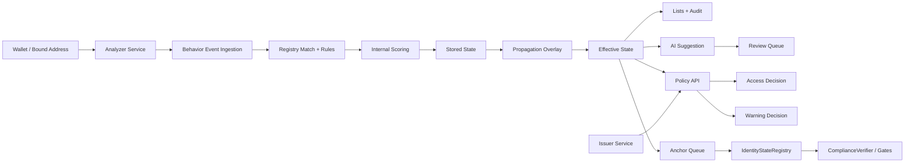

# Phase3 Report

## Summary
Phase3 extends Web3ID from a credential-and-state demo into a state-driven risk control plane. The implementation keeps critical enforcement compatible with the existing verifier and gate contracts while moving dynamic risk assessment, review, list management, and audit history into off-chain services.

## Architecture

## Behavior Flow
1. A signed binding links a wallet address to a root or sub identity.
2. The analyzer scans local EVM activity and classifies events using the registry snapshot.
3. Deterministic signals are generated from mixer, sanctioned, governance, trusted-DeFi, and repeated unknown-contract patterns.
4. Scores are computed with decay rules and state thresholds.
5. Stored state is replayed from deterministic plus manual signals.
6. Propagation produces root escalation and sibling overlays without rewriting local stored state.
7. Effective state is computed from stored state plus overlays.
8. Lists, audits, AI suggestions, and optional review items are updated.
9. AccessPolicy combines proof/credential validity, risk state, and policy version.
10. WarningPolicy returns `info`, `warn`, or `high_warn` without blocking.

## Propagation Rules
- `sub -> root OBSERVED`: only after repeated same-family observations across multiple sub identities.
- `sub -> root RESTRICTED/HIGH_RISK`: requires root-sensitive rules, direct root evidence, or multi-sub convergence.
- `sub -> root FROZEN`: only escalates strongly when governance, sanctions, or coordinated critical behavior exists.
- `root -> sub`: implemented as effective-state floors, not blanket stored-state rewrites.
- `scope_class`: same-scope siblings only receive `OBSERVED` overlays.

## Re-entry
- `OBSERVED -> NORMAL`: 7 clean days plus positive behavior or timer expiry.
- `RESTRICTED -> OBSERVED`: 14 clean days, no high/critical signals, and score below threshold.
- `HIGH_RISK -> RESTRICTED`: 30 clean days, at least two positive signals, and no open review item.
- `FROZEN -> HIGH_RISK`: manual or governance release only.
- Manual release creates a floor window so recovery cannot skip required observation periods.

## Anchoring
- `OBSERVED` remains chain-offline.
- `RESTRICTED/HIGH_RISK/FROZEN` for root identities and compliance-relevant sub identities queue anchors.
- Anchors now include `stateHash` and `evidenceBundleHash`.
- The registry keeps backward-compatible getters plus `getStateSnapshotV2` and `getAuditAnchorsV2`.

## Bindings
- `/bindings/challenge` issues a one-time challenge.
- `/bindings` requires a candidate signature and, depending on mode, either a sub-identity link proof or a same-root authorization proof.
- Binding evidence is written into the audit log and reused for later event attribution.

## AI Boundary
- AI never writes state directly.
- Suggestions are limited to `watch`, `review`, or `warn_only`.
- `review` items remain pending until a human confirms them.
- Confirmed AI outcomes are written as explicit manual-review signals and audited separately from the original suggestion.

## Demo Coverage
- RWA access path now has Phase3 access-policy evaluation alongside the legacy verifier flow.
- Warning-only evaluation is exposed for risky counterparties.
- The local demo script seeds trusted-DeFi, governance, and mixer interactions to demonstrate the full pipeline.

## Verification Performed
- `cmd /c pnpm --filter @web3id/risk lint`
- `cmd /c pnpm --filter @web3id/risk test`
- `cmd /c pnpm --filter @web3id/analyzer-service lint`
- `cmd /c pnpm --filter @web3id/analyzer-service test`
- `cmd /c pnpm --filter @web3id/policy-api lint`
- `cmd /c pnpm --filter @web3id/policy-api test`
- `cmd /c pnpm --filter @web3id/sdk lint`
- `cmd /c pnpm --filter @web3id/frontend lint`
- `cmd /c pnpm --dir contracts test`

## Known Limits
- The current demo scanner is block-by-block and local-first; it is correct for the MVP but not optimized for large ranges.
- Same-root proof validation is intentionally lightweight and assumes the local identity tree is the source of truth.
- Warning evaluation currently uses policy-api logic only; there is no on-chain warning path by design.
