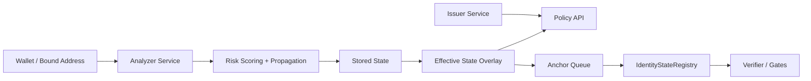

# Web3ID Phase3

Web3ID Phase3 is a state-driven identity, risk, and policy demo for Web3 access control. It keeps critical enforcement on-chain through the existing verifier and gate contracts while moving dynamic risk assessment, bindings, AI review, audit history, and access composition into off-chain services.

Web3ID 第三阶段是一个以状态驱动为核心的 Web3 身份、风险与策略决策演示系统。关键执行边界仍由现有链上 verifier 和 gates 保证，而动态风险评估、地址绑定、AI 复核、审计历史与准入组合判断主要在链下服务完成。

## Overview / 项目概览

The project has evolved from a Phase2 credential-and-compliance demo into a Phase3 risk control plane. The current demo exposes three end-to-end flows: `RWA Access`, `Enterprise Treasury`, and `Social Governance`, now backed by analyzer, policy, and anchoring services.

项目已经从 Phase2 的 credential/compliance 演示，演进为 Phase3 的风险控制平面。当前仓库包含三条完整演示链路：`RWA Access`、`Enterprise Treasury`、`Social Governance`，并新增 analyzer、policy、anchoring 等 Phase3 核心能力。

## What's New in Phase3 / Phase3 新增能力

- State-driven risk pipeline from behavior events to final policy decisions. - 从行为事件到最终策略决策的状态驱动风险链路。
- Conditional root escalation with propagation rules instead of blanket state rewrites. - 用条件上卷和传播规则替代粗暴的全局状态改写。
- Stored state and effective state are separated to preserve local evidence while applying overlays safely. - `stored state` 与 `effective state` 分离，既保留本地证据，又安全施加 overlay。
- Challenge-based bindings require control-proof before activity can be attributed to an identity. - 绑定必须基于 challenge 与控制权证明，链上行为才能归属到身份。
- Key-state anchoring now records `stateHash` and `evidenceBundleHash` for compliance-relevant transitions. - 关键状态锚定会记录 `stateHash` 与 `evidenceBundleHash`。
- Access decisions combine `credential/proof validity + risk state + policy version`. - 最终准入判断显式组合 `credential/proof validity + risk state + policy version`。
- Warning-only evaluation stays separate from blocking access decisions. - warning-only 路径独立存在，不直接阻断访问。
- AI suggestions are limited to `watch`, `review`, and `warn_only`, with human confirmation required for review outcomes. - AI 建议被限制为 `watch`、`review`、`warn_only`，其中 `review` 必须经人工确认。

## Architecture / 架构概览

Phase3 keeps the contract layer focused on verification and state anchoring, while the off-chain control plane handles behavior ingestion, scoring, propagation, reviews, and final access composition. See `PHASE3_REPORT.md` for the full propagation matrix and deeper implementation notes.

Phase3 保持合约层专注于验证与状态锚定，链下控制平面负责行为采集、评分、传播、复核与最终准入组合判断。完整传播矩阵与更细的实现说明见 `PHASE3_REPORT.md`。



## Workspace Layout / 仓库结构

- `apps/frontend`: React demo UI for Phase2 and Phase3 flows, including stored/effective state, bindings, anchors, reviews, and decision breakdowns.
- `apps/issuer-service`: file-backed issuer and identity-context service for credentials, revocation, verification, and compatibility flows.
- `apps/analyzer-service`: off-chain risk control plane for ingestion, scoring, propagation, review queue, bindings, audits, and anchor queue.
- `apps/policy-api`: access and warning decision service that combines proof validity, credential validity, risk state, and policy version.
- `packages/identity`: deterministic root/sub identity derivation plus same-root and link-proof helpers.
- `packages/credential`: credential schemas, typed-data attestations, and W3C-compatible exports.
- `packages/state`: shared state enums, attribution flow, consequence rules, recovery, and propagation helpers.
- `packages/policy`: policy identifiers, templates, and request helpers.
- `packages/proof`: holder-binding proof setup and browser/Node proving helpers.
- `packages/risk`: Phase3 ingestion, scoring, propagation, re-entry, bindings, AI review, anchoring, and policy helper logic.
- `packages/sdk`: shared client helpers for issuer, analyzer, policy, and verifier interactions.
- `contracts`: Foundry contracts for registries, verifier, RWA access, enterprise treasury, and social governance gates.

## Quick Start / 快速开始

Use the Phase3 path as the default local entrypoint:

默认情况下，请直接走 Phase3 启动路径：

```powershell
pnpm install
pnpm proof:setup
pnpm demo:stage3
```

`pnpm demo:stage3` starts the full local stack and seeds demo data for Phase3:

`pnpm demo:stage3` 会启动完整本地栈，并注入 Phase3 演示数据：

- Issuer service: `http://127.0.0.1:4100`
- Analyzer service: `http://127.0.0.1:4200`
- Policy API: `http://127.0.0.1:4300`
- Frontend: `http://127.0.0.1:3000`

Fresh clones should still run `pnpm proof:setup` before browser proving or demo flows. `pnpm demo:stage2` remains available as the reinforced Phase2 baseline, but it is no longer the main happy path.

新 clone 的仓库仍应先执行 `pnpm proof:setup`，否则浏览器 proving 和本地 demo 无法正常工作。`pnpm demo:stage2` 仍保留作为 Reinforced Phase2 基线，但已经不再是首页推荐主路径。

## Main Commands / 常用命令

```powershell
pnpm -r build
pnpm -r test
pnpm -r lint
pnpm proof:setup
pnpm demo:stage3
pnpm demo:e2e:stage3
pnpm contracts:test
pnpm demo:stage2
```

Stage3 E2E expects the demo stack to already be running. Start `pnpm demo:stage3` in a separate terminal first.

Stage3 的 E2E 依赖 demo stack 预先启动，请先在另一个终端运行 `pnpm demo:stage3`。

## Core Invariants / 核心不变量

These protocol boundaries are intentionally stable across phases:

以下协议边界被设计为跨阶段保持稳定：

- Root identity derivation: `rootId = keccak256("did:pkh:eip155:<chainId>:<checksumAddress>")`, then `identityId = keccak256(rootId)`.
- Sub identity derivation: `subIdentityId = keccak256(rootId + normalizedScope + subIdentityType)`, then `identityId = keccak256(subIdentityId)`.
- `IdentityState` ordering remains fixed: `INIT=0`, `NORMAL=1`, `OBSERVED=2`, `RESTRICTED=3`, `HIGH_RISK=4`, `FROZEN=5`.
- On-chain verification never trusts caller-supplied state in the payload; state is loaded from `IdentityStateRegistry`.
- Final access allow/restrict/deny in Phase3 must be based on proof validity, credential validity, risk state, and policy version together.

## Verification Status / 验证状态

The current Phase3 repo state has been validated across the main surfaces that matter for a local demo and acceptance run:

当前 Phase3 仓库状态已经在本地 demo 和验收相关的关键面上完成验证：

- Analyzer service tests
- Policy API tests
- Frontend build
- Contracts tests
- Stage3 Playwright E2E
- `pnpm demo:stage3` smoke run

## Docs / 延伸文档

- [`README_PHASE3.md`](README_PHASE3.md) - Phase3 implementation notes / 第三阶段实现说明
- [`PHASE3_REPORT.md`](PHASE3_REPORT.md) - architecture, propagation, anchoring, and verification summary / 架构、传播、锚定与验证总结
- [`docs/default-vs-compliance-mode.md`](docs/default-vs-compliance-mode.md) - default mode vs compliance mode
- [`docs/ai-risk-policy-governance-boundaries.md`](docs/ai-risk-policy-governance-boundaries.md) - AI, risk, policy, and governance boundaries
- [`docs/state-attribution-and-consequence-flow.md`](docs/state-attribution-and-consequence-flow.md) - state attribution and consequence flow
- [`docs/system-invariants.md`](docs/system-invariants.md) - system invariants
