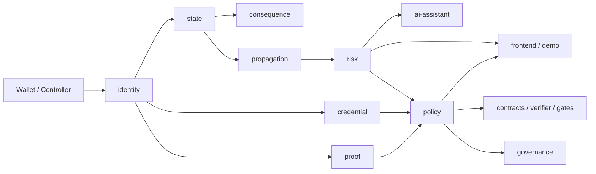

# Web3ID 平台基线

本页是 P0 收口后的平台冻结基线。

- 用途：统一解释 Web3ID 当前平台结构、稳定边界、默认入口和阶段映射。
- 优先级：高于阶段性说明文档。`README_PHASE3.md`、`PHASE3_REPORT.md` 和其余 `docs/*.md` 作为补充资料存在。
- 冻结目标：保持 capability-first、effective mode、六段式状态链路、传播规则、AI 边界不变。

## 平台总览

## 模块边界

### 稳定基线
- `identity`
  Root / Sub Identity 派生、scope 归一化、capability-first、policy support 判定。
- `credential`
  凭证 bundle、typed data attestation、issuer/revocation 校验。
- `proof`
  holder-bound / credential-bound proof runtime、浏览器和 Node proving 入口。
- `state`
  `signal -> assessment -> decision -> state update -> consequence application -> recovery/propagation` 主链路。
- `consequence`
  运营处置记录，不替代状态语义。
- `propagation`
  `LOCAL_ONLY / SAME_SCOPE_CLASS / ROOT_ESCALATION / GLOBAL_LOCKDOWN` 传播级别和 overlay 规则。
- `policy`
  allowedModes、requiresComplianceMode、proof template、state range、risk action。
- `governance`
  override-only，应急治理和全局锁定保留权限。
- `risk`
  analyzer/risk package 的评分、名单、review queue、anchor queue、risk context。
- `ai-assistant`
  只能生成 suggestion / explanation，不直接写 state。

### 可局部优化但不能改核心语义
- `frontend / demo`
  可以继续做产品化、入口整理和验收体验优化，但不能改平台语义。
- `issuer-service / analyzer-service / policy-api`
  可以继续做 API 组织、错误提示、日志与测试增强，但不能改平台不变量。
- `proof tooling`
  可以继续优化冷启动、缓存、路径稳定性，但 proof 语义和公用运行产物约定不变。

## 统一路径定义

### Default Path
- 使用 `holder_bound_proof`。
- 不要求 issuer-backed credential。
- effective mode 由 policy 允许 `DEFAULT_BEHAVIOR_MODE` 且 identity 支持 holder binding 决定。
- 典型场景：`GOV_VOTE_V1`、`AIRDROP_ELIGIBILITY_V1`、`COMMUNITY_POST_V1`。

### Compliance Path
- 使用 `credential_bound_proof`。
- 需要 issuer validation、linked credentials、policy 允许 `COMPLIANCE_MODE`。
- 最终放行仍同时依赖 proof、credential、risk state、policy version。
- 典型场景：`RWA_BUY_V2`、`ENTITY_PAYMENT_V1`、`ENTITY_AUDIT_V1`。

## 阶段到平台视角的映射

| Stage | 平台视角 | 主要入口 | 说明 |
| --- | --- | --- | --- |
| Stage1 | 最小可跑平台基线 | `pnpm demo:stage1` | Root/Sub identity、issuer、proof happy path、RWA 最小闭环。 |
| Stage2 | 强化后的 baseline | `pnpm demo:stage2` | 强化 default/compliance path、状态与 consequence 基础能力。 |
| Stage3 | 完整平台控制面 | `pnpm demo:stage3` | analyzer、policy-api、stored/effective state、review queue、anchors。 |
| Platform | 推荐平台入口 | `pnpm demo:platform` | 以统一平台叙事启动完整 Stage3 栈。 |

## 当前推荐入口

- 快速理解平台：先读本页，再看 `docs/IDENTITY_INVARIANTS.md`、`docs/STATE_SYSTEM_INVARIANTS.md`、`docs/BOUNDARIES.md`。
- 快速运行：
  `pnpm install`
  `pnpm proof:setup`
  `pnpm demo:platform`
- 快速验收：
  `pnpm proof:smoke`
  `pnpm test:integration`

## 冻结语义清单

- Root Identity 唯一且不可变，Sub Identity 由 `rootId + normalizedScope + subIdentityType` 决定。
- Identity 不带永久 mode 标签；mode 通过 capability + policy 解析为 effective mode。
- 状态链路顺序固定，state 与 consequence 分离。
- propagated effect 只影响 effective state，不回写 child stored state。
- AI 只能生成 suggestion，不是 final decision。
- proof 只证明可证明事实，不能包装 AI 结论。
